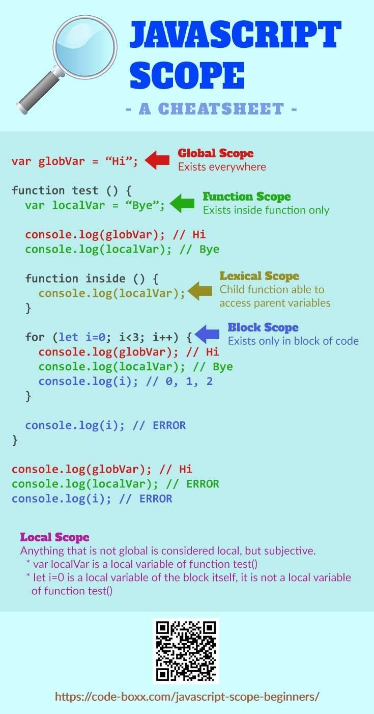

 # Javascript for the Software Test Engineer

## First, a moment from our sponsors
- All programming languages boil down to  translating your commands to binary, to control the CPU. 
- There are many programming languages, but like a set othat best fit the use of a certain language. Here are a few:
    - C++ or C# is a low level language used for creating firmware drivers, operating systems, and cpu heavy software like video games or video editting software.
    - Java is a compiled language used to create desktop software usually. 
    - Python is an interpreted language used to write backend web services (APIs) for websites and also for data science to analyze data
    - Javascript is an interpreted language. typically used in the browser for manipulating the HTML from a website.

<br>

 ## Javascript vs Node.JS
 - Javascript is a client side scripting language. This means it runs in the browser. It typically is used to listen for events like click and responds with actions like taking you to another page or returning certain data.
 - Node.Js is a runtime environment, that allows you to use Javascript on a computer instead of the server. It has different global objects (commands that allow you to interact with something) than the browser Javascript since its not running in the browser, but in your computer. Here are a few:
    - Javascript: Window, Document, etc.
    - Node.Js: Console, Process, etc. 

<br>

## Types of Execution
Every programming language's point of existence is to execute our commands. There are 4 ways to execute commands:

<br>

- **Step by Step**. <br>
This is the most popular execution where commands are called one after another. 

``` javascript
$('button=Submit').waitForDisplayed()
$('button=Submit').click()
$('h2').waitForDisplayed()
const header = $('h2').getText()
header.includes('Successful')
```
<br>

- **Object oriented programming**. <br>
OOP is all about creating reusable code and not repeating yourself. The below example saves the xpaths, webdriverio findelement objects ($()), and wraps the steps to login into one function on a page called login.page.js. This page is then imported in a loginTest.spec.js where the login() is called from the loginPage. This function can be called in 100 tests without writing all of the steps everytime. 

``` javascript
// class syntax
class pageName extends basePage {

    get getterName() { return $('xpath') }


    sampleFunc(parameter) {
        // step by step
    }
    
}

export default new pageName()

```

``` javascript
// pages/login.page.js
class loginPage extends basePage {

    get username() { return $('//input[@id="username"]') }
    get password() { return $('//input[@id="password"]') }
    get submitBtn () { return $('button=Submit') }

    login(username, password) {
        this.username.waitForDisplayed()
        this.username.setValue(username)
        this.password.waitForDisplayed()
        this.password.setValue(password)
        this.submitBtn.click()
    }

}

export default new loginPage()

// loginTest.spec.js
import loginPage from '../pages/login.page.js'

loginPage.login('admin', 'qwer1234')
$('h2').waitForDisplayed()
const banner = $('h2').getText()
banner.includes('Logged in')
```
<br>


- **Conditional Execution** <br>
There are various ways to perform Conditional execution, including switch, try/catch, and if/else statements like the below example. Conditionals are used to control data flow as well as process flow. 

    - The first example states if bannerText equals (== since = is for assignment) 'Success', then log to the console 'Successfully signed in' or else log a new error.
    - The second example states if subBannerText does NOT (!) equal '404 error', then log to the console a message and continue or else log an error.

``` javascript
// syntax for if/else statement

If (condition) { // this is true
    // Do something
} else {
    // Do something else
}

// syntax for tenary statement
If this is true ? Do something : Otherwise do something else
```

``` javascript
const bannerText = $('h2').getText()

if (bannerText == 'Success') { 
    console.log('Successfully signed in')
    continue
} else {
    new Error('Check the banner')
}
```

``` javascript
const subBannerText = $('h3').getText()

if (!subBannerText == '404 error') { 
    console.log('Successfully signed in')
    continue
} else {
    new Error('Check the sub banner')
}
```

<br>

- **Loop execution** <br>
Loops are a huge time saver when looping through arrays or objects. The below example starts by finding all the anchor tags (a) then we use a forEach() loop to go through all of the links and push the text to the actualNavTitles array. Finally, we compare the actual list to the expected. This saves a lot of effort, especially when there is a need to loop hundreds of items.

``` javascript
const links = $$('a')
const expectedNavTitles = ['Home', 'Shop', 'Contact us']
const actualNavTitles = []

links.forEach((link)=> {
    actualNavTitles.push(link.getText())
})

actualNavTitles.some(actualTitle => expectedNavTitles.includes(actualTitle))
```

<br>


## Common Data types

- **Variables** <br>
Containers for any data types to be used later. We assign values to them with the equal sign (=). 
``` javascript
const town // can't override data
let city // can override data later
```


<br> 

- **Strings** <br>
  Plain used when typing in a input field, logging to the console, saving an XPATH, etc.

``` javascript
const name = 'Tom'
console.log(name) // 'Tom'

$('//input[@="username"]').setValue(name) // would type Tom in the username input field
```
<br> 

- **Numbers** <br>
A number that can be calculated later

``` javascript
const age = 65
console.log(age) // 65

console.log(age + 2) // 67

console.log(age + '2') // '652'. Since 2 is now a string data type, Javascript concatenates the two data types into a string
```
<br> 

- **Undefined** <br> 
In webdriverio, Undefined is returned when we are attempting to get a value from an element that doesn't exist, or not yet displayed. In this case, check your spelling and also use a waitForDisplayed() before attempting to get the text.

``` javascript
$('a=spelledWrog').getText() // Undefined
```
<br> 

- **Null** <br>
Means no value. In the case below, there is no text to get. 

``` javascript
$('div[@id="num1"]').getText() // null
```
<br> 

- **Booleans** <br>
Boolean is when true or false is returned if a condition exist or not. For software testing, we use assertion libraries like ChaiJS.
``` javascript
$('h2').getText().includes('Welcome') // true
```
<br>

- **Arrays** <br>
Arrays are identified by their square brackets []. Arrays are basically a list of items. You can imagine a box of groceries. Arrays are zero based, meaning the first object in the array's position is 0, not 1. 
    - In the first example, we add the text we expect our buttons to have to an array, and assign the array to a variable
    - Next we add to the array with the push function
    - We can get the length of the array with the length property. Notice there is no (), because it is not a function.
    - In the 4th line, we can access a specific position in the array with the square brackets. By accessing [1], we get the second object.
    - In webdriverio, using findElements ($$()), an array of objects, containing the element IDs is returned.
    - We can use the array's forEach() to loop through each button and get its text or some other function like click or even adding the values to another array.
``` javascript
const expectedButtonsText = ['Submit', 'Call now']

expectedButtonsText.push('Reset') // ['Submit', 'Call now', 'Reset']

expectedButtonsText.length // 3

expectedButtonsText[1] // 'Call now'

const buttons = $$('button') // [ { Element: 467654456-554 }, { Element: 467654456-554 } ]

buttons.forEach((button) => {
    button.getText() // 'Submit', 'Call now'
})
```
<br>

- **Object** <br>
Objects are identified by curly brackets {}. Objects are similar to arrays as in they are used to list objects, but they also add a more definitive way of searching for an object via the key. Once you find the key, a value is returned. 
    - In the first example we show how to make an object that holds fake credentials
    - Next we show how to access the object via the key
    - In the webdriverio example, we see findElement $() returns an object with an element ID. 
    - We hard coded the values here, but for front end and back end development, the values of the object would be mapped from a front end form and the object would be sent to the backend to save to a database.

``` javascript
const credentials = {
    'username': 'Bill', // key = username
    'password': 'jjir9r4j' // value = jjir9r4j
}

console.log(credentials['username']) // 'Bill'

$('//input[@id="username"]') // { Element: 449494994-494 }
```
<br>

- **Function** <br>
A Function is a data type that allows you to perform an action. Functions work like a bottle:
    - Can pour into the bottle with parameters (). There is a placeholder in the parameter when creating the function, but when calling it, it is replaced with an actual value.
    - Can mix in other functions inside the body {}. Many tasks like assigning variables, if/else statements, loops, etc. can be saved in a function. Try to maintain single responsibility with functions, meaning have it do one thing. 
    - Can pour out the contents using the return keyword.

    Call back function explained:
    - Cook finishes the dish and says order up while handing the dish to the waiter
    - Waiter proceeds to take the dish to the customer

``` javascript
label(cap) { inside the bottle } // syntax

// Simple Example: 1
testFunction(name) {
    return name
}

console.log(testFunction('Tom')) // 'Tom'

// Refactored Example 2
testFuncWithConditions(name) {
    if (name === 'Tom') {
        return `${name} is in the house!`
    } else {
        return `Sorry we do not know a ${name}`
    }
}

console.log(testFuncWithConditions('Bill')) // 'Sorry we do not know a Bill'


```
<br>
