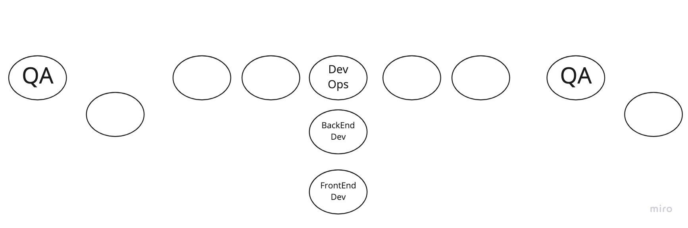

# First...a word from our sponsors
- What you do NOT need to get a Software Test Engineer job:
    - To know everything about programming
    - A formal education 
- You do need to know how to:
    - Search for a topic on Google and/or Youtube
    - Be a problem solver. Think before coding
    - Learn a tool from the perspective of your role first, then the rest if necessary
    - Use paper and pen

 

# What is an Automation Test Engineer?
- Who? Devs make the software and we make sure it is working as expected and report any bugs
- What?
	- Titles are Software Test Engineer, Quality Assurance, Automation Engineer. 
	- Essential Skills on the resume: Linux commands, A Programming Language (JS, Python, Java, etc), Selenium, API understanding
	- Salary ranges from $100k ($48/hr) up to $200k ($96/hr)
- Where? In office or remote
- When? As long as there is software
- Why? Ensure security, data persistence, website appearance and functionality persist from deployment to deployment

 

# A day in the life of a Software Test Engineer
- Grab your coffee and attend stand up
	- This will satisfy the question "Are you familiar with Agile Development?"
	- A stand up is a morning meeting that last about 15 mins with the Product Owner, Scrum master, Developers and QAs
	- Stand ups are apart of 2 week project activities called sprints
	- Sprints are made up of tasks called stories which break down goals or software features called epics
- Work on automating test scenarios
	- update the framework based on 
		- Old and new features or bugs
		- changes from the deployment
	- research
	- ask for help
		- DevOps = Deployments via CICD tools and System changes (AWS, Linux, etc). Grunt work in setting up runs and blocking security issues.
		- QAs =  Catch the bugs. Not seen as much, but stars if they do great
		- Frontend Devs = Everyone can see their designs. They have the highlight reel like a running back.
		- Backend Devs = Backend web services that connect to the Databases. Lead the team to success or we fail terribly due to their code, like a Quarterback.

 

