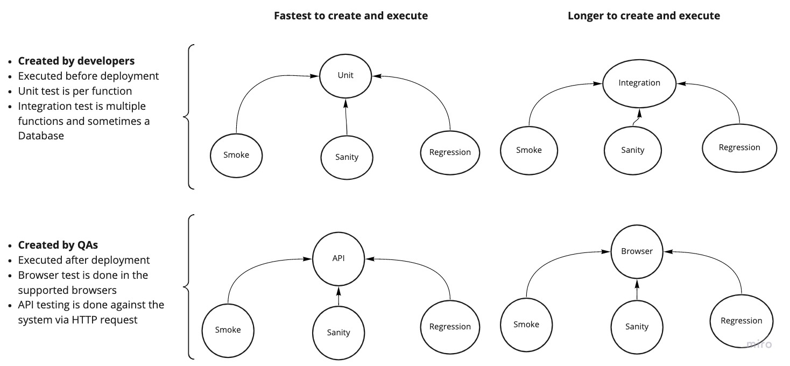
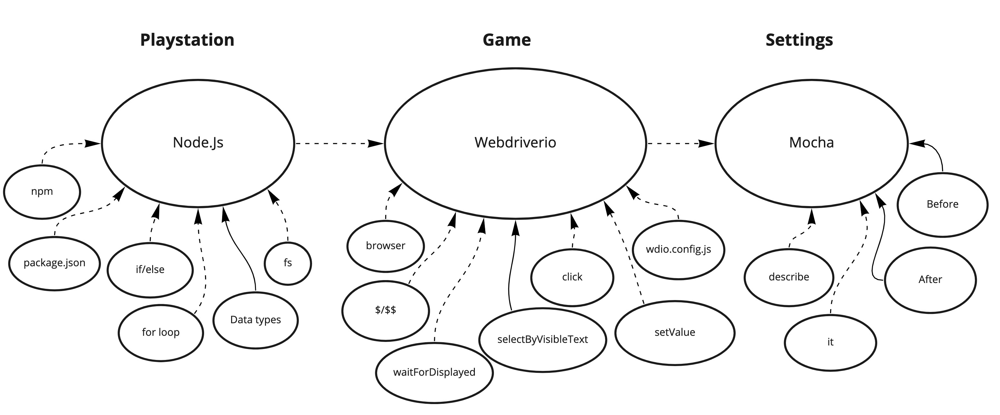

# Tests?

## Functional Tests

### Automated Tests 
- Unit: Done on the functions themselves
- Integration: See if the Functions work together properly. ie API tests for HTTP req/res and DB.
- UI tests: Tests against the browser.

### Application behavior tests
- Smoke: Ensure the app loads correctly
- Sanity: Ensure major and minor features perform as expected
- Regression: Ensure resolved bugs do not resurface

 

### Tools
- Mocha: Test framework that reports pass/fail and catches exceptions
- Webdriverio: Browser testing tool

 

---

## Non functional tests

### System behavior tests
- Load: Simulate the expected average amount of users performing actions on the website.
- Spike: Perform a load test, then inject X times the average amount of users for a short period of time.
- Stress: Simulate X times the average amount of users for an extended time.

### Tools
- JMeter performance testing tool in Java
- K6 performance testing tool in Javascript