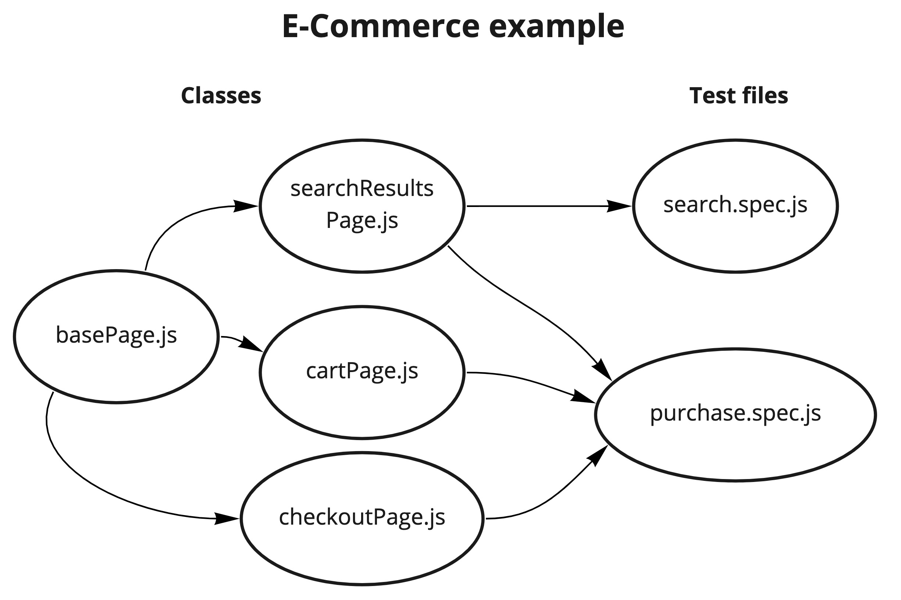
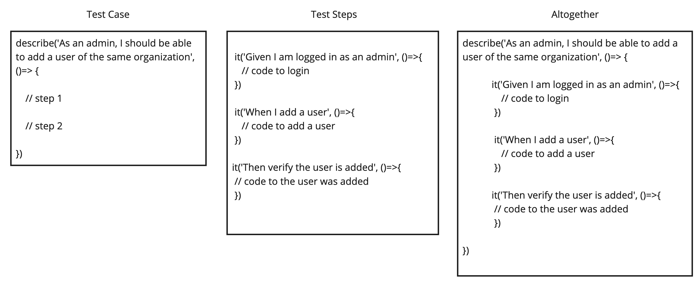

# Page Object Model 


## Page Object Model?

### Consist of: 
- For each page of the website, we save all the web elements to a class of the same name and create functions to interact with those web elements. 
    - Typically we start with a basePage class that will hold common utility functions that can be used on any page of the site like goToHomePage() or getDate(). 
- Test files will import the classes and use the web elements or functions to perform the tests.
    - Calling the elements instead of hard coding them in the test, helps when you need to update the location of the element ie instead of updating 100 tests, you update on class.



<br>

## Classes

Classes are files that hold all of the locators for the web pages web elements (buttons, input fields, etc). Classes come from Object Oriented Programming.
- For each page that has its own web elements, make a new class.
- They start with the key word class, the name of the file, extends the basePage then {}. Extends means inherit its properties and functions.  
``` javascript
class loginPage extends basePage {
    // properties

    // functions
}
```
- Properties are like the arms of the body. In this case, the arm is the web elements saved to getter functions. Basically the functions gets the value of the element from the browser and waits for you to tell it what to do with it. 

``` javascript
class loginPage extends basePage {

    // property

    get username() {
        return $('//input[@id="username"]') // $() finds the username field, when this property is called, then returns the element ID from the browser
    }

}
```

- Functions are like the movement of the arm, like push or pull. You typically want your function to have one job. We might make a function as simple as wait for the element to be displayed then click it. We might also make a complex function for login that goes to the web page, enters the user name and password, then clicks the login button and waits for the home page. 

``` javascript
class loginPage extends basePage {

    get username() { return $('//input[@id="username"]') }
    get password() { return $('//input[@id="password"]') }
    get loginBtn() { return $('//button[@id="loginButton"]') }

    // function

    login(username, password) {
        browser.url('/') // url saved in wdio.conf.js
        this.username.waitForDisplayed()
        this.username.setValue(username) 
        this.username.waitForDisplayed()
        this.username.setValue(password)
        this.loginBtn.click()

    }

}
```


- Lastly, we export that function, so that it can be imported into a test file. 

``` javascript
class loginPage extends basePage {
    // properties

    // functions
}

export default new loginPage() // this will allow us to import the class later
```

<br>

## Test Specification Files

The test spec.js file spurns a browser instance. The Test Spec file itself, represents one browser instance, and by nature one user. So if you have 100 spec.js files, eventually 100 browser instances will open. 
- The maximum amount of spec.js files to run at one time is controlled via the wdio.conf.js file under maxInstances.
- Typically, you want to test one feature per spec.js, but you can have multiple test cases (describe()) in a spec file.
- To use the property or function we created earlier, we first need to import the class.

``` javascript
import loginPage from '../pages/loginPage'

// test step
loginPage.login()

```


<br>


## Which Framework did you use?

Mocha is the name of the test framework that we use. 
- Other frameworks include Cucumber, Jasmine, TestNG, JUNIT, etc.
- Frameworks help guide your test case and step creation. 
- The Test Spec file itself, represents one browser instance, and by nature one user. It is a best practice to test one feature per spec file.
- The Describe() function or hook, is used to designate a test case. Example: 
    - As a user, I should be able to search for a product by size.
    - As an admin, I should be able to add a user of the same organization
    - As a user, I should not be able to enter a phone number with the incorrect format
- The IT() function or hook, is used to designate a test step. Example:
    - Given I am logged in as user
    - When I click add to the cart
    - Then verify the cart addition




- The describe() and it() accepts two parameters, a string and a function. The string is printed in the console once the test is done. The function records the behaviors of the test and finally the results. Heres an example with parameters spaced out. The spaces are just for the human, the computer reads the code the same.

``` javascript
import loginPage from '../pages/loginPage'

describe('As a user, I should not be able to ...', () => {
        
    it('Given I logged in', () => {
        loginPage.login()
    })

    // more steps
        
})
```


<br>


## A word on Gherkin 

Gherkin is a just a way to write descriptions of your test steps. You don't have to stick to them, but it helps make each step clear to the person coming after you.
- Given: Used for common steps like logging in, going to a certain page, etc.
- When: Used for interactions leading up to the test.
- Then: Used for assertions
- And: Continues Given, When, and Then steps

<br>

## The End Goal: Autonomous Tests 
- Small simple tests. No assertions till you get to the area you want to test
- Dont forget to keep it KISS aka Keep It Simple Stupid
	- Dont create code for things you don't need now.
	- Don't make a million assertions, especially for things that change often
- DRY aka Don't Repeat Yourself
	- Steps example: There will be several steps to logging, so once you get all the steps to work, save them in a function.
	- Spec file Example: Lets say you have to create a user to test the app you work on. Try to limit the amount of time to create users by creating one in your first describe, then searching for them in the other describes when you do your test.