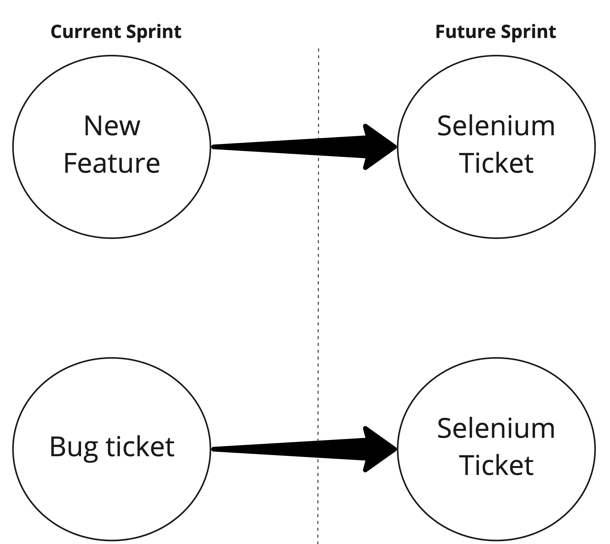

# A word from our sponsors

## The minimum amount of JS needed and which specs we will address them in
There are a lot of tutorials on the internet. We suggest when learning more about a topic to search for it in context to the job you are getting. If you search for Javascript tutorials, most likely they will teach you front end Javascript which is not really necessary for a Software Test Engineer. If you search Selenium, the majority of the examples will be in Java, which is similar, but a lot more code. Below you will find a simple list of topics to dive deeper on for Javascript.

- variables (assignment and scope - fileD) and data types (string, nums, booleans, arrays)
- object oriented programming - all
- conditionals and loops - File downloads

Further details are in the Javascript_reference, but we will talk through the specs

<br>

# Basic Webdriver Protocol

## What are the different types of manual tests that can be automated?

Lets look at the types of manual tests that you will automate and a few of the wdio commands that you will use. 

<br>

## Smoke: 

Smoke tests just ensure thats the site and its elements loads and no server errors are present. 

<br>

**navigation**: used to go to a certain page of the website
``` javascript
browser.url('/endpoint') // appends on the the baseUrl in the wdio.config.js
browser.back() // tells the browser to go back a page
```
**findElement**: used to find a tag in HTML
``` javascript
$('xpath') // returns an object with that includes an element ID. Example: 
{ Element: 4984849894-333 }
```
**findElements**: " Whats the difference between findElement and findElements?". findElements finds all the elements and saves them to an array.

``` javascript
$$('a') // returns an array of objects, that includes the element ID. Example in the console if there were two a tags on the website: 
[ { Element: 4984849894-333 }, { Element: 4984849894-334 } ]
```
**states**: get information about the element
``` javascript
$('h1').getText() // returns a string like 'Welcome to the Site'

$('h1').getHTML() // returns the string of HTML like <h1>Welcome to the Site</h1>

```
**assertions**: stop execution immediately if the result is false and fails the test
``` javascript
$('h1').getText() === 'Welcome to the Site' // check if an elements text equals a specific string

$('h1').getText().includes('Welcome to the Site') // check if an elements text includes a part of a string

$('//input').isDisplayed() // check if an element is not hidden in the HTML

$('//input').isExisting() // check if an element is in the HTML at all

!$('h1').getText() === '404' // check that an element does NOT have the text 404
```

<br>

## Sanity (How to test dynamic websites?): 

When interacting with a dynamic website, you should wait for the element to appear, before interacting with it.

<br>

**waits**: "Whats the difference between implicit wait vs explicit wait?"
``` javascript
$('button=Submit').waitForDisplayed() // uses default waitFor timeout in wdio.conf.js aka implicit wait

$('button=Submit').waitForDisplayed(30000) // overrides default timeout aka explicit wait

browser.pause(3000) // pauses execution for the amount of ms, in this case 3 seconds

browser.waitUntil(()=> {
    return $('h4=Hello World!').isExisting()
})


```
**interaction**: Used to click buttons, submit forms, select from drop downs, etc.
``` javascript
$('button=Submit').click() // for anything clickable

$('//input[@id="username"]').setValue('text to type in the field') // for input fields

$('//select').selectByVisibleText('German Sheppard') // for drop downs with select tags
```


<br>

### Regression (How did you track bugs?)
- Create a bug ticket once the bug is verified reproducible with manual testing
- Once resolved, we create a spec file for the bug and place in the regression folder

