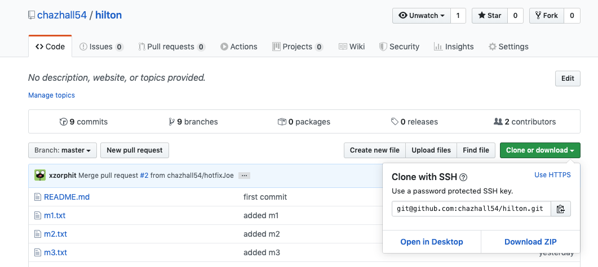
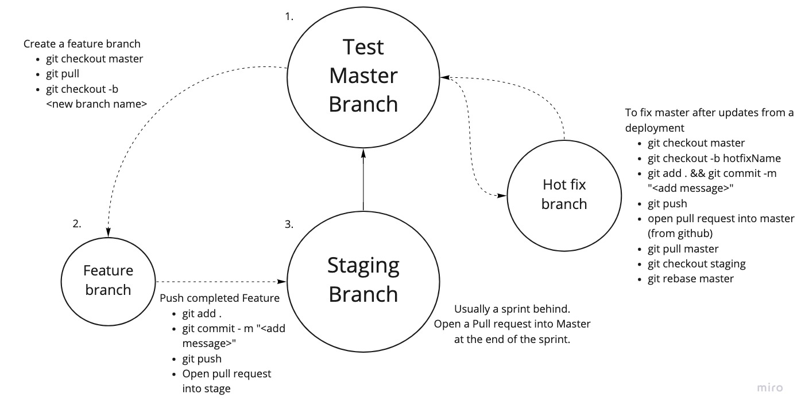

# Git hub ... and the story about a version named 7.16.2

## What is Git? 

Git and Github is used for version control. Its like the Dropbox for code.
- Git is installed on your computer and it is used to track your files. 
- Github is the cloud based repo where teams can store code for projects.

<br>

How versioning works:
- Example: 7.16.2
- The first number is the Major, breaking change. You may need to update the underlying programming language or other dependencies to use it.
- The second number is the Minor updates. This includes new features.
- the third number is for the Patches. Any bug fixes alter this number.

<br>

## Pre-requisites to use Github and Git

1. Create an account on github
    - Go to https://github.com/ and fill out the form
    - Remember the email that you used. Its important!

2. Create an SSH key from your computer, for Github. This saves you from having to enter your credentials often. Open your terminal (git bash for win) and enter the following commands one by one: 
``` bash
git config --global user.name "Your name here"
```
``` bash
git config --global user.email "your_email@example.com"
```
``` bash
ssh-keygen -t rsa -C "your_email@example.com" # press enter to name your file the default
```
``` bash
if mac: 
pbcopy < ~/.ssh/id_rsa.pub 

if win:
vi ~/.ssh/id_rsa.pub 
# copy all the contents of the file
# press esc 
# :q 
# press enter
```
<br>

Go to account settings in github 
- click ssh keys 
- paste the ssh key
- add a title and save

<br>

Test connection in terminal with:
``` bash
ssh -T git@github.com # should say something like "Successfully authenticated"
```

<br>

# Every day commands

## Clone the repo

First they will add you to their repo. This may be an existing Selenium project or one you will make from scratch, but your test suite should have its own repo. Go to the repo, and click "Clone or Download", choose use SSH, and copy the url. See the example below:



In the terminal, enter the below command and replace "\<URL>" with the copied url from github.  
``` bash
git clone <URL>
```
<br>

## Daily process



To work on a new feature/Test spec:
``` bash
git checkout master # or Staging, which ever has the current work
```
``` bash
git checkout -b <newBranchName>
```

<br>

After adding files, they need to be tracked by git, staged and pushed to the repo
``` bash
git add . # this adds all of the files or replace "." with the file name
```
``` bash
 git commit -m "Add your message" # this stages the tracked files 
```
``` bash
git push # to push your changes and branch to git hub. From here you can open pull request into staging
```

<br>

To pull down changes from another branch, do the following. 
```bash
git checkout <branchName>
```
``` bash
git pull # to pull changes from the github for the branch
```

<br>

Other well used commands
``` bash
git status # to see what files are tracked or ready for staging
```
``` bash
git init # to start a repo. You will still need to make a repo in the GUI before being able to push to it
```
``` bash
git merge <branchName> # brings another local branch, into your current branch
```
``` bash
git clone <URL> # used to clone a repo
```


