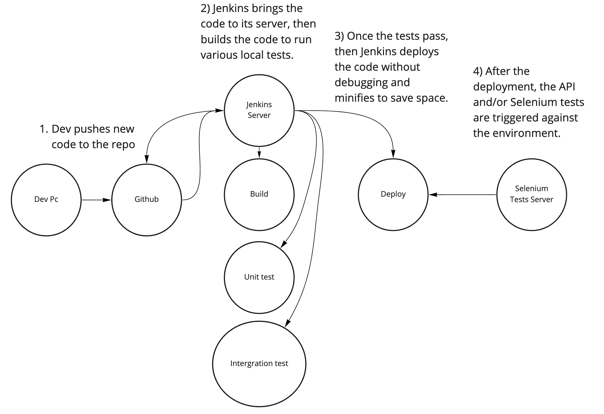

# Continous Integration and Continous Deployment



<br>

---

## Setup your Automation Server with AWS and Jenkins

Start up an EC2 instance, ssh into it and switch to the root user.

Install Java

``` bash
sudo yum -y install java-1.8*
```

Install wget
``` bash
sudo yum install wget
```

Install Jenkins
``` bash
sudo wget -O /etc/yum.repos.d/jenkins.repo https://pkg.jenkins.io/redhat-stable/jenkins.repo # downloads the repo

sudo rpm --import https://pkg.jenkins.io/redhat-stable/jenkins.io.key # imports the repo's public key

sudo yum install jenkins # installs jenkins
```

Start the Jenkins service
``` bash
sudo systemctl start jenkins.service
sudo systemctl status jenkins.service
```

Get the inital Jenkins password
``` bash
cat /var/lib/jenkins/secrets/initialAdminPassword # should return a long string
```

Update AWS and login to Jenkins
- Add 8080 as an inbound rule for the EC2 instance
- Go to the public IP:8080, enter the password, install the plugins and set credentials

<br>

---
## Build your pipeline

Install Chrome 
``` bash
wget https://dl.google.com/linux/direct/google-chrome-stable_current_x86_64.rpm

sudo yum install ./google-chrome-stable_current_*.rpm
```

Install Git
``` bash
dnf install git
```

Add NodeJS to Jenkins
- click manage jenkins 
- click manage plugins
- click the available tab
- choose nodejs
- choose download without restart

Configure NodeJS in Jenkins: 
- click manage jenkins 
- click Global Tool Configuration 
- add nodejs 10.16.1
- save

Establish a Pipeline
- Click New Item
- Name and choose "Pipeline"
- Discard old builds
- Add the Github project URL
- Build Triggers: Github hook trigger
- Copy and paste the sample pipeline

``` groovy
pipeline {
   agent any
   
   tools {nodejs "node"}

   stages {
      stage('clone the repo') {
         steps {
            git 'https://github.com/chazhall54/tr_qa_class'
         }
      }
      
      stage('Install dependencies') {
         steps {
            sh 'npm install'
         }
      }
      
     stage('run test') {
         steps {
            sh 'headless=true npm run test'
         }
      }
   }
}


```

Once our pipeline builds, Automate the pipeline. 
- Add above groovy script to Jenkinsfile in the root of your directory and push to your repo
- In your Jenkins pipeline, change the Pipeline script to Pipeline script from SCM and choose Git
- Paste your github url and save

<br>

---

## Allure Reporting in Jenkins

Install the wdio-allure plugin
``` bash
npm install @wdio/allure-reporter --save-dev
```
<br>

Add allure reporter to your wdio.conf.js
``` javascript
    reporters: ['spec', ['allure', {
        outputDir: 'allure-results',
        disableWebdriverStepsReporting: true,
        disableWebdriverScreenshotsReporting: true,
    }]],
```

<br>


add screenshots on failure
``` javascript
afterTest: function(test) {
    if (test.error !== undefined) {
      browser.takeScreenshot();
    }
  }
```

<br>


add Allure to pipeline steps
``` groovy
stage('reports') {
   steps {
      script {
         allure([
            includeProperties: false,
            jdk: '',
            properties: [],
            reportBuildPolicy: 'ALWAYS',
            results: [[path: 'allure-results']]
         ])
      }
   }
}
```

<br>


add report script to your package.json for local execution
``` javascript
"report": "allure generate allure-results/ && allure open"
```

<br>


add to git ignore
``` bash
allure-reports
allure-results
```

<br>


add Allure to Jenkins
- manage jenkins
- manage plugins
- search for Allure and download without restart
- global tool configuration

